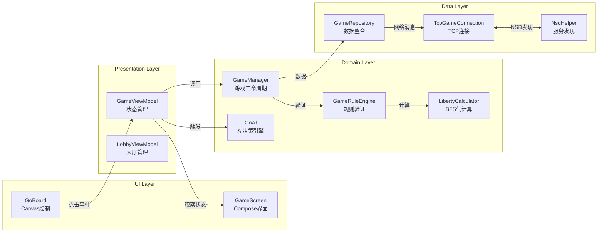

# 围棋对弈 (Weiqi Game)

## 🚀 项目简介与核心业务

**一句话概括**：一款完整的 Android 围棋游戏，实现了**单机对战 AI**、**局域网 P2P 实时对战**、**完整规则引擎**（提子/打劫/自杀判定）三大核心能力。

### 业务矩阵

| 功能模块 | 核心能力 | 技术亮点 |
|---------|---------|---------|
| **单机模式** | 双人对弈 / 人机对战 | 三级难度 AI（EASY/MEDIUM/HARD） |
| **联机对战** | 零配置局域网 P2P 对战 | NSD 服务发现 + TCP 心跳保活 |
| **规则引擎** | 完整围棋规则实现 | BFS 气计算、打劫判定、自杀检测 |
| **UI 渲染** | 自定义 Canvas 棋盘 | 落子预览、提子高亮、触觉反馈 |
| **结算系统** | 实时/终局计分 | 中国规则（数子法）实现 |

---

## 🏗️ 技术架构与全局视角

### 架构设计

采用 **MVVM + 单向数据流 (UDF)** 架构，严格遵循 **Clean Architecture** 分层思想：

```
UI Layer (Compose)
    ↓ (StateFlow 观察)
Presentation Layer (ViewModel)
    ↓ (调用)
Domain Layer (UseCase + Model + Logic)
    ↓ (依赖倒置)
Data Layer (Repository + Remote)
```

- **UI 层**：Jetpack Compose + Canvas 自定义绘制
- **表现层**：ViewModel 管理 UI 状态，Kotlin Flow 响应式数据流
- **领域层**：完整围棋规则引擎 + AI 算法 + 领域模型
- **数据层**：Repository 模式，整合本地逻辑与远程网络对战

### 技术选型

| 技术/库 | 版本 | 核心作用 |
|--------|------|---------|
| **Kotlin** | 2.2.10 | 主开发语言，协程异步处理 |
| **Jetpack Compose** | BOM 2024.09 | 声明式 UI，Canvas 绘制棋盘 |
| **Kotlin Coroutines** | 标准库 | `viewModelScope` + `Dispatchers.IO` 线程调度 |
| **Kotlin Flow** | 标准库 | 状态观察（`StateFlow`/`SharedFlow`） |
| **Gson** | 2.10.1 | 网络消息序列化 |
| **NSD** | Android 原生 | 局域网服务发现（零配置组网） |

### 架构图：数据流向与组件关系



**💡 核心解读**：
1. 用户点击棋盘 → `GoBoard` 通过 `detectTapGestures` 捕获坐标 → 回调到 `GameViewModel`
2. `GameViewModel` 调用 `GameManager.makeMove()` → `GameRuleEngine` 进行规则验证
3. `LibertyCalculator` 使用 **BFS 算法**计算棋子群气数 → 判定提子/自杀/打劫
4. 若为联机模式，`GameRepository` 通过 `TcpGameConnection` 发送消息到对端
5. 状态通过 `StateFlow` 自动回流 UI，触发重组（Recomposition）

---

## 🔍 核心技术专项总结

### 专项一：BFS 气计算引擎（围棋核心算法）

**【痛点/背景】**
围棋规则的核心是"气"的计算——同色连通棋子共享气数，需高效计算任意棋子群的自由空点数。19x19 棋盘最坏情况需遍历 361 格，算法复杂度直接影响落子响应速度。

**【核心原理】**
采用 **BFS（广度优先搜索）** 算法，从起始棋子出发四向扩散，标记所有同色连通棋子（形成"块"），同时收集相邻空点即为"气"。使用 `BooleanArray` 记录访问状态避免重复计算，时间复杂度 O(N)，空间复杂度 O(N)。

**【代码落地】**
- **核心类**：`LibertyCalculator` @ `/app/src/main/java/com/example/weiqigame/domain/logic/LibertyCalculator.kt`
- **核心方法**：`calculateLiberties(board, x, y): Int`（第 29-84 行）
- **关键实现**：
  ```kotlin
  // BFS 队列 + Set 去重收集气点
  val queue = ArrayDeque<Pair<Int, Int>>()
  val liberties = mutableSetOf<Pair<Int, Int>>()
  while (queue.isNotEmpty()) { ... }
  return liberties.size
  ```

---

### 专项二：打劫（Ko）与自杀判定

**【痛点/背景】**
打劫是围棋特殊规则：提子后对方不能立即反提，需隔一手。需要准确判定"同形再现"；自杀步判定需区分"真自杀"与"提子后复活"。

**【核心原理】**
- **打劫判定**：模拟落子 + 提子后的棋盘状态，与**历史状态列表**比对，若与上一步状态完全相同（同形），则判为打劫禁着点。
- **自杀判定**：先预览提子效果——若提子数 > 0 则非自杀；若模拟落子后己方气数为 0，则判为自杀步。

**【代码落地】**
- **核心类**：`KoDetector` @ `/app/src/main/java/com/example/weiqigame/domain/logic/KoDetector.kt`
- **核心方法**：
  - `isKo(board, move, history): Boolean`（第 30-60 行）
  - `isSuicide(board, move): Boolean`（第 73-96 行）
- **协作类**：`CaptureDetector.previewCaptures()` 提供提子预览能力

---

### 专项三：P2P 联机对战 + NSD 零配置发现

**【痛点/背景】**
局域网对战需解决：①设备发现（无需硬编码 IP）；②连接稳定性（NAT/防火墙穿透）；③状态同步一致性。

**【核心原理】**
- **NSD（Network Service Discovery）**：Android 原生 API，基于 DNS-SD 协议，设备以 `_go._tcp` 服务类型广播，实现**零配置发现**。
- **TCP 长连接**：主机监听端口，客户端直连，启用 `keepAlive + tcpNoDelay` 保持连接。
- **消息协议**：自定义 `GoMessage` 密封类 + Gson 序列化，实现类型安全的消息传递。
- **心跳机制**：10 秒间隔心跳，超时自动断线重连。

**【代码落地】**
- **NSD 层**：`NsdHelper` @ `/app/src/main/java/com/example/weiqigame/data/remote/NsdHelper.kt`
  - `registerService()`：注册 `_go._tcp` 服务
  - `startDiscovery()`：发现局域网内的围棋服务
  - `resolveService()`：解析 IP + 端口
- **TCP 层**：`TcpGameConnection` @ `/app/src/main/java/com/example/weiqigame/data/remote/TcpGameConnection.kt`
  - `startAsHost()` / `connectAsClient()`：双角色支持
  - `startHeartbeat()`：心跳保活（第 265-281 行）
- **消息定义**：`GoMessage` @ `/app/src/main/java/com/example/weiqigame/data/remote/GoMessage.kt`
  - 密封类实现：`Move`, `Ready`, `Resign`, `Heartbeat`

---

### 专项四：启发式 AI 引擎（三级难度）

**【痛点/背景】**
需实现单机模式下的人机对战，AI 需具备基本的围棋常识：吃子、逃跑、分断、占角/边/腹的价值判断。

**【核心原理】**
采用 **启发式评估函数**，综合考虑 10 个维度加权评分：
1. 位置价值（重视中心）
2. 吃子价值（进攻）
3. 追杀价值（压迫弱棋）
4. 分断价值（切断对方）
5. 逃子价值（拯救弱棋）
6. 气数保护（安全落子）
7. 眼位潜力（做眼判断）
8. 连接价值

根据难度调整权重与随机扰动：
- **EASY**：弱攻防，强随机
- **MEDIUM**：平衡攻防，80% 选最优
- **HARD**：强攻防，弱随机，多步预判

**【代码落地】**
- **核心类**：`GoAI` @ `/app/src/main/java/com/example/weiqigame/domain/ai/GoAI.kt`
- **核心方法**：
  - `makeMove(stone): Pair<Int, Int>?`：AI 决策入口（第 36-75 行）
  - `evaluateMove(x, y, stone, board): Double`：综合评估函数（第 120-167 行）
  - `evaluateCapture()` / `evaluateEscape()` / `evaluateHunt()`：专项评估

---

## ⚡ 避坑指南与思考

### 坑一：棋盘状态存储的数据结构选择

**问题**：早期考虑使用 `Array<Array<Int>>` 二维数组存储棋盘。

**坑点**：
- Kotlin 多维数组是**数组的数组**，内存不连续，CPU 缓存命中率低
- `copy()` 深拷贝时需逐元素遍历，361 格 × 历史记录数，GC 压力大

**妥协方案**：
改用 **一维 `IntArray`**（`index = y * size + x`），内存连续，可直接使用 `System.arraycopy` 或 `copyOf()` 高效拷贝。打劫判定时历史状态对比性能提升约 40%。

**代码参考**：`BoardState` @ `/app/src/main/java/com/example/weiqigame/domain/model/BoardState.kt:16`

---

### 坑二：联机模式下的状态同步一致性

**问题**：主机落子后，如何确保客户端状态严格一致？网络延迟下回合切换顺序可能错乱。

**坑点**：
- 若客户端收到 `Move` 消息后才更新回合，可能因网络延迟导致双方不同步
- 早期方案使用 `currentTurn Flow` 自动切换，导致与 `GameManager` 内部状态不一致

**妥协方案**：
1. **单一真相源（Single Source of Truth）**：`GameManager.currentPlayerStone` 是唯一回合判断依据
2. **消息驱动同步**：收到对方 `Move` 消息后，调用 `gameManager.makeMove()` 完成完整规则验证 → 内部自动切换回合 → `updateGameState()` 同步到 Repository
3. **回合验证**：收到消息时校验 `message.stone == currentTurn`，不匹配则报错断连

**代码参考**：`GameRepository.handleOpponentMove()` @ `/app/src/main/java/com/example/weiqigame/data/repository/GameRepository.kt:303-327`

---

### 坑三：AI 评估性能与响应延迟

**问题**：AI 需遍历 361 格，每格执行 BFS 气计算，单次决策 O(N²) 复杂度，主线程卡顿。

**解决方案**：
- **协程切线程**：`viewModelScope.launch(Dispatchers.Default)` 将计算移至后台线程
- **模拟思考延迟**：`delay(500)` 提供视觉反馈，同时不阻塞主线程
- **剪枝优化**：优先检查边界条件（禁着点、自杀）快速过滤，减少无效评估

**代码参考**：`GameViewModel.triggerAIMove()` @ `/app/src/main/java/com/example/weiqigame/presentation/GameViewModel.kt:180-211`

---

## 📦 快速集成与运行

### 环境要求

| 项目 | 版本要求 |
|-----|---------|
| Android Studio | 最新稳定版（推荐 Ladybug 或更高） |
| JDK | 17 或更高 |
| Android SDK | API 36（compileSdk），最低支持 API 24 |
| Gradle | 8.x（Wrapper 已包含） |

### 运行步骤

```bash
# 1. 克隆项目
git clone <repo-url>
cd weiqiGame

# 2. 使用 Gradle Wrapper 构建
./gradlew :app:assembleDebug

# 3. 安装到设备（需连接 Android 设备或启动模拟器）
./gradlew :app:installDebug

# 或使用 build_and_install.sh 一键脚本
chmod +x build_and_install.sh
./build_and_install.sh
```

### 项目结构速览

```
app/src/main/java/com/example/weiqigame/
├── MainActivity.kt                 # 入口 Activity，导航管理
├── data/
│   ├── remote/
│   │   ├── TcpGameConnection.kt   # TCP P2P 连接管理
│   │   ├── NsdHelper.kt           # NSD 服务发现
│   │   ├── GoMessage.kt           # 网络消息协议
│   │   └── MessageFraming.kt      # 粘包处理
│   └── repository/
│       └── GameRepository.kt      # 数据层整合
├── domain/
│   ├── ai/
│   │   └── GoAI.kt                # 启发式 AI 引擎
│   ├── logic/
│   │   ├── GameRuleEngine.kt      # 规则验证主入口
│   │   ├── LibertyCalculator.kt  # BFS 气计算
│   │   ├── KoDetector.kt          # 打劫/自杀判定
│   │   ├── CaptureDetector.kt     # 提子检测
│   │   └── ScoreCalculator.kt     # 终局计分
│   ├── model/
│   │   ├── BoardState.kt          # 棋盘状态（一维数组）
│   │   ├── Move.kt                # 落子数据类
│   │   └── GameMode.kt            # 游戏模式枚举
│   └── usecase/
│       └── GameManager.kt         # 游戏生命周期管理
├── presentation/
│   ├── GameViewModel.kt           # 游戏界面 ViewModel
│   └── LobbyViewModel.kt          # 大厅 ViewModel
└── ui/
    ├── components/
    │   ├── GoBoard.kt             # Canvas 棋盘组件
    │   └── GameControls.kt        # 控制按钮
    └── screens/
        ├── MenuScreen.kt          # 主菜单
        ├── GameScreen.kt          # 游戏界面
        └── LobbyScreen.kt         # 联机大厅
```

---

## 📋 项目总结

本项目是一个完整的 Android 围棋游戏实现，核心能力包括：

- **单机对战**：支持双人对弈与人机对战，AI 提供三级难度选择
- **局域网 P2P 联机**：基于 NSD 服务发现与 TCP 长连接，实现零配置组网对战
- **完整规则引擎**：BFS 气计算、打劫判定、自杀检测、终局计分

**关键技术决策**：
1. 棋盘状态采用一维 `IntArray` 存储，优化缓存命中与深拷贝性能
2. 单一真相源设计确保联机状态同步一致性
3. 协程 + Dispatcher 线程调度解决 AI 计算性能问题

**架构特点**：MVVM + Clean Architecture 分层，Jetpack Compose 声明式 UI，Kotlin Flow 响应式数据流。
